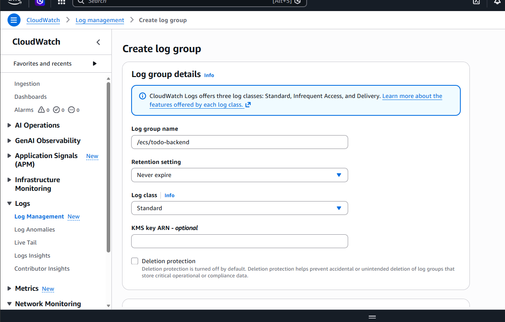
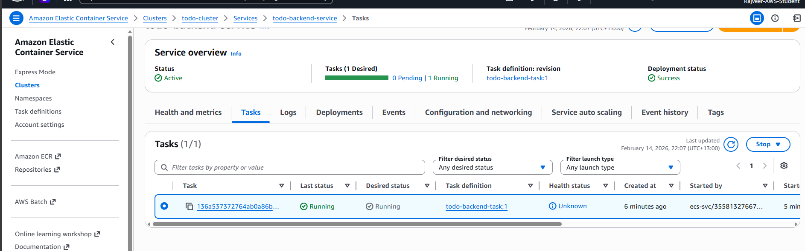

🛠 Deployment Challenge: ECS Task Failing Due to Missing CloudWatch Log Group

1\. Issue Encountered

During deployment of the backend service (todo-backend-service) on AWS ECS Fargate, tasks repeatedly failed with the following error:

ResourceInitializationError:

failed to validate logger args:

failed to create CloudWatch log stream:

ResourceNotFoundException:

The specified log group does not exist.

The ECS task status showed:

STOPPED

TaskFailedToStart

ResourceInitializationError

2\. Root Cause Analysis

The container log configuration was set to use the awslogs driver:

Log Driver: awslogs

Log Group: /ecs/todo-backend

Region: us-east-1

Stream Prefix: ecs

However, the CloudWatch Log Group:

/ecs/todo-backend

had not been created.

Since Fargate requires the log group to exist before creating log streams, the task failed during initialization.

3\. Resolution Steps

Step 1 – Create Missing Log Group

Navigated to:

AWS Console → CloudWatch → Log groups → Create log group

Created:

/ecs/todo-backend

Step 2 – Force New Deployment

Navigated to:

ECS → Cluster → Services → todo-backend-service → Update

Selected:

✔ Force new deployment

After redeployment, tasks transitioned from:

STOPPED → PENDING → RUNNING

4\. Outcome

ECS service became stable

Tasks entered RUNNING state

CloudWatch log streams were successfully created

Backend service deployed successfully

5\. Lessons Learned

This issue demonstrated:

Understanding of ECS task lifecycle

CloudWatch Logs integration with Fargate

Infrastructure troubleshooting

Production-style deployment debugging

Importance of log group pre-configuration

\### ECS Task Failure

### Log Group Created

### Tasks Running Successfully

